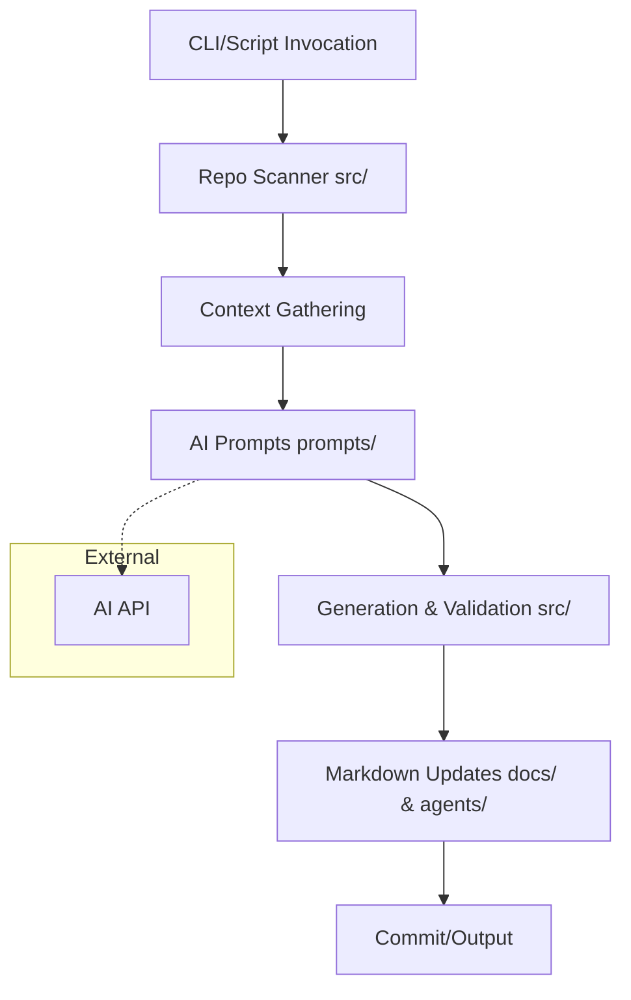

<!-- agent-update:start:architecture-notes -->
# Architecture Notes

The system is a monolith TypeScript application designed as an AI scaffolding tool for generating documentation and agent playbooks. It leverages AI prompts to automate content updates based on repository state. The design prioritizes simplicity and local execution, using Node.js runtime for building, testing, and running scaffolding tasks. This evolved from a need to maintain up-to-date docs in AI-driven projects without manual overhead, favoring a single-repo structure over distributed services for faster iteration.

## System Architecture Overview
The application is a monolithic Node.js/TypeScript project, executed locally or in CI environments via npm scripts. It processes repository metadata (e.g., git status, file scans) to drive AI-assisted updates to Markdown files in `docs/` and `agents/`. There are no runtime services; instead, it operates as a build-time or on-demand tool.

Requests (user invocations) start via CLI commands or scripts, which parse the repo, gather context (e.g., file lists, summaries), and feed into prompt-based AI calls. Control flows from entry scripts in `src/` through modular functions handling parsing, updating, and validation, pivoting to AI APIs for content generation.

Deployment is straightforward: install dependencies with `npm install` and run via `npm start` or custom scripts. No containerization or cloud deployment is configured, keeping it lightweight for developer workflows.

## Core System Components
- **prompts/**: Directory containing AI prompt templates (2 files), used to guide content generation for docs and agents.
- **src/**: Core source code (56 files), including modules for repository scanning, Markdown parsing/updating, AI integration, and validation logic.
- **package.json**: Defines dependencies (e.g., TypeScript, Jest for testing), scripts, and project metadata.
- **tsconfig.json**: TypeScript configuration for compilation and module resolution.
- **jest.config.js**: Configuration for unit and integration testing.
- **README.md**: Project entry point with setup and usage instructions.
- **CONTRIBUTING.md**: Guidelines for contributors (1 file).
- **LICENSE**: Project licensing information (1 file).
- **package-lock.json**: Locked dependency versions for reproducible builds.
- **example-documentation.ts**: Sample TypeScript file demonstrating documentation patterns (1 file).

## Internal System Boundaries
The codebase defines clear seams between domains:
- **Repository Analysis**: Handled in `src/` modules for git/file scanning, enforcing bounded contexts around metadata extraction without touching AI logic.
- **AI Prompting and Generation**: Isolated in prompt-loading and API-calling functions, with data ownership via JSON/serialized structures to avoid direct file mutations until validation.
- **Documentation Updating**: Post-generation, updates are confined to Markdown parsers/writers, synchronizing via temporary in-memory models before committing changes.
Shared contracts are enforced through TypeScript interfaces (e.g., for update payloads), with no shared mutable state to minimize coupling.

## System Integration Points
- **Inbound Interfaces**: Primarily CLI or npm script invocations; no public APIs or webhooks. Repository scanning acts as the main "event" trigger.
- **Outbound Orchestration**: The system coordinates with AI providers (e.g., via OpenAI-compatible APIs) for content generation. Internal calls are synchronous within the Node.js process, with no external service dependencies beyond AI endpoints.

## External Service Dependencies
- **AI APIs (e.g., OpenAI or equivalents)**: Used for prompt-based text generation. Authentication via API keys in environment variables; rate limits managed by exponential backoff in code. Failures are handled with retries and fallbacks to static templates.
- **Git/Node.js Ecosystem**: Relies on local git for status checks and npm/yarn for builds. No rate limits, but assumes standard tooling availability.
- **No Other SaaS**: The design avoids additional third-parties to reduce external failure points.

## Key Decisions & Trade-offs
- **Monolith over Microservices**: Chosen for simplicity in a tooling project; avoids deployment complexity but limits scalability for very large repos (trade-off: faster local runs vs. potential perf bottlenecks in `src/` scanning).
- **AI-Driven Updates**: Leverages prompts for automation, winning over manual docs due to repo evolution speed. Experimented with rule-based generators but selected AI for handling nuanced Markdown (ADR-like decision in initial setup; no formal ADRs yet).
- **TypeScript Enforcement**: Prioritizes type safety for parsing/updating, trading some dev speed for fewer runtime errors in AI output handling.
- **No Persistent Storage**: Relies on file system for state, simplifying setup but requiring git for versioning (trade-off: zero-infra vs. potential merge conflicts).

No recent ADRs; architecture stable post-initial scaffolding setup (commit hash: initial bootstrap, e.g., from repo history).

## Diagrams

This high-level flow diagram illustrates the linear processing pipeline.

No external monitoring dashboards; local testing via Jest covers integration points.

## Risks & Constraints
- **Performance**: Scanning 67 files (0.43 MB repo) is fast locally but could slow on massive repos; constraint: assumes <1GB repos without pagination.
- **AI Variability**: Outputs may drift with model updates; technical debt: lacks diff-based validation beyond basic checks—recommend human review for critical docs.
- **Dependency on External AI**: Rate limits or outages halt updates; mitigation: offline mode with placeholders.
- **Technical Debt**: Incomplete agent playbooks in `agents/` (if present); scaling to multi-language support unaddressed.
- **Assumptions**: Git clean state for accurate scanning; Node.js 18+ required.

## Top Directories Snapshot
- **prompts/**: 2 files (AI templates).
- **src/**: 56 files (core logic, including scanners, parsers, and AI wrappers).
- Root files: package.json, tsconfig.json, jest.config.js, README.md, CONTRIBUTING.md, LICENSE, package-lock.json, example-documentation.ts.

<!-- agent-readonly:guidance -->
## AI Update Checklist
1. Review ADRs, design docs, or major PRs for architectural changes.
2. Verify that each documented decision still holds; mark superseded choices clearly.
3. Capture upstream/downstream impacts (APIs, events, data flows).
4. Update Risks & Constraints with active incident learnings or TODO debt.
5. Link any new diagrams or dashboards referenced in recent work.

<!-- agent-readonly:sources -->
## Acceptable Sources
- ADR folders, `/docs/architecture` notes, or RFC threads.
- Dependency visualisations from build tooling or scripts.
- Issue tracker discussions vetted by maintainers.

## Related Resources
- [Project Overview](./project-overview.md)
- Update [agents/README.md](../agents/README.md) when architecture changes.

<!-- agent-update:end -->
