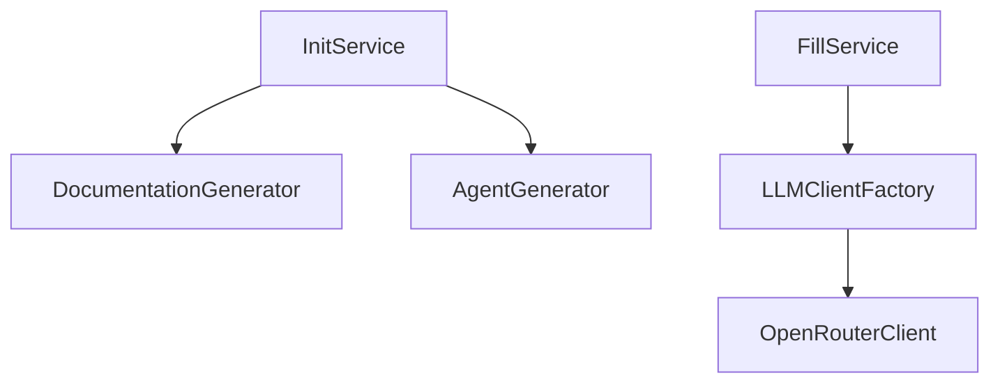

# Plano de Melhoria: Integração LSP para Geração de Planos, Agentes e Docs

## Resumo Executivo

Este documento propõe a integração de capacidades LSP (Language Server Protocol) no ai-coders-context, inspirado no projeto [Serena](https://github.com/oraios/serena), para melhorar significativamente a qualidade e precisão da geração de planos, playbooks de agentes e documentação.

---

## Problema Atual

### Limitações do FileMapper Atual

O `FileMapper` atual (`src/utils/fileMapper.ts`) oferece apenas análise superficial:

```typescript
// O que temos hoje:
- Lista de arquivos e extensões
- Contagem de arquivos por diretório
- Tamanho de arquivos
- Estrutura de diretórios top-level
```

**O que está faltando:**
- Símbolos do código (classes, funções, interfaces, tipos)
- Relacionamentos entre componentes (imports, dependências)
- Hierarquia de tipos (herança, implementações)
- Referências cruzadas (quem usa o quê)
- Estrutura semântica do código

### Impacto nas Gerações Atuais

| Componente | Limitação |
|------------|-----------|
| **Planos** | Não conhecem a estrutura real do código, geram fases genéricas |
| **Agentes** | Playbooks baseados apenas em diretórios, sem contexto de APIs/interfaces |
| **Docs** | Architecture.md é placeholder, não reflete componentes reais |

---

## Solução Proposta

### Opção A: Integração Direta com Serena (via MCP)

**Descrição:** Usar Serena como servidor MCP para obter informações semânticas do código.

```
┌─────────────────────┐     MCP      ┌─────────────────────┐
│  ai-coders-context  │◄────────────►│       Serena        │
│                     │              │   (MCP Server)      │
│  - PlanGenerator    │              │                     │
│  - AgentGenerator   │              │   - find_symbol     │
│  - DocGenerator     │              │   - get_references  │
│                     │              │   - get_definition  │
└─────────────────────┘              └─────────────────────┘
                                              │
                                              ▼
                                     ┌─────────────────────┐
                                     │   Language Servers  │
                                     │   (TypeScript, Go,  │
                                     │    Python, etc.)    │
                                     └─────────────────────┘
```

**Prós:**
- Implementação rápida (Serena já existe e funciona)
- Suporte a 30+ linguagens out-of-the-box
- Comunidade ativa e manutenção externa
- Integração via MCP já suportada pelo ecossistema Claude

**Contras:**
- Dependência externa
- Requer Serena rodando como serviço
- Overhead de comunicação inter-processo

**Esforço estimado:** 2-3 semanas

---

### Opção B: LSP Client Nativo (Inspirado no Serena)

**Descrição:** Implementar nosso próprio cliente LSP usando `vscode-languageclient` ou similar.

```
┌─────────────────────┐
│  ai-coders-context  │
│                     │
│  ┌───────────────┐  │
│  │  LSPService   │  │
│  │               │  │
│  │ - initialize  │  │
│  │ - getSymbols  │  │
│  │ - getReferences│ │
│  │ - getHover    │  │
│  └───────┬───────┘  │
│          │          │
│  ┌───────▼───────┐  │
│  │SymbolAnalyzer │  │
│  │               │  │
│  │ - classes     │  │
│  │ - functions   │  │
│  │ - interfaces  │  │
│  │ - dependencies│  │
│  └───────────────┘  │
└─────────────────────┘
          │
          ▼
┌─────────────────────┐
│  Language Servers   │
│  (tsserver, pylsp,  │
│   gopls, etc.)      │
└─────────────────────┘
```

**Prós:**
- Controle total sobre a implementação
- Sem dependências externas em runtime
- Customização específica para nossas necessidades
- Distribuição como pacote único

**Contras:**
- Maior esforço de implementação
- Necessidade de manter suporte a múltiplas linguagens
- Complexidade de gerenciar lifecycle de language servers

**Esforço estimado:** 6-8 semanas

---

### Opção C: Híbrido - Tree-sitter + LSP Seletivo

**Descrição:** Usar Tree-sitter para análise sintática rápida e LSP apenas para operações semânticas avançadas.

```
┌─────────────────────────────────────────┐
│           ai-coders-context             │
│                                         │
│  ┌─────────────┐    ┌─────────────────┐ │
│  │ Tree-sitter │    │   LSP Client    │ │
│  │  (Parsing)  │    │  (Semantics)    │ │
│  │             │    │                 │ │
│  │ - AST       │    │ - References    │ │
│  │ - Symbols   │    │ - Definitions   │ │
│  │ - Structure │    │ - Type Info     │ │
│  └──────┬──────┘    └────────┬────────┘ │
│         │                    │          │
│         └────────┬───────────┘          │
│                  ▼                      │
│         ┌─────────────────┐             │
│         │ CodebaseContext │             │
│         │                 │             │
│         │ - Symbols       │             │
│         │ - Dependencies  │             │
│         │ - Architecture  │             │
│         └─────────────────┘             │
└─────────────────────────────────────────┘
```

**Prós:**
- Tree-sitter é muito rápido (parsing local)
- LSP apenas quando necessário (análise profunda)
- Bom equilíbrio entre performance e funcionalidade
- Tree-sitter suporta 100+ linguagens

**Contras:**
- Dois sistemas para manter
- Tree-sitter não fornece informações de tipo
- Complexidade adicional de integração

**Esforço estimado:** 4-5 semanas

---

## Recomendação: Abordagem Faseada

### Fase 1: Integração Serena via MCP (Semanas 1-3)

**Objetivo:** Validar valor da análise semântica com menor esforço.

```typescript
// Novo serviço: src/services/semantic/serenaClient.ts
interface SerenaClient {
  initialize(projectPath: string): Promise<void>;
  findSymbol(name: string): Promise<Symbol[]>;
  getReferences(symbol: Symbol): Promise<Reference[]>;
  getDefinition(location: Location): Promise<Definition>;
  getProjectStructure(): Promise<ProjectStructure>;
}
```

**Entregas:**
1. `SerenaClient` como wrapper do MCP
2. `SemanticAnalyzer` que usa SerenaClient
3. Integração com `DocumentationGenerator`
4. Testes de validação

**Arquivos a criar/modificar:**
```
src/
├── services/
│   └── semantic/
│       ├── serenaClient.ts      # Cliente MCP para Serena
│       ├── semanticAnalyzer.ts  # Análise de estrutura de código
│       └── types.ts             # Tipos para símbolos/referências
├── generators/
│   ├── documentation/
│   │   └── documentationGenerator.ts  # Integrar contexto semântico
│   ├── agents/
│   │   └── agentGenerator.ts          # Integrar contexto semântico
│   └── plans/
│       └── planGenerator.ts           # Integrar contexto semântico
└── utils/
    └── fileMapper.ts                  # Estender com dados semânticos
```

---

### Fase 2: Enriquecimento de Contexto (Semanas 4-5)

**Objetivo:** Usar dados semânticos para melhorar gerações.

**Novo tipo de contexto:**
```typescript
interface SemanticContext {
  // Símbolos principais do projeto
  symbols: {
    classes: ClassSymbol[];
    interfaces: InterfaceSymbol[];
    functions: FunctionSymbol[];
    types: TypeSymbol[];
  };

  // Grafo de dependências
  dependencies: {
    imports: ImportMap;
    exports: ExportMap;
    references: ReferenceGraph;
  };

  // Arquitetura inferida
  architecture: {
    layers: ArchitectureLayer[];
    patterns: DetectedPattern[];
    entryPoints: EntryPoint[];
  };
}
```

**Melhorias nos templates:**

```markdown
<!-- ANTES (genérico) -->
## Arquitetura
TODO: Descrever a arquitetura do projeto

<!-- DEPOIS (específico) -->
## Arquitetura

### Camadas Identificadas
- **Services** (4 classes): `InitService`, `FillService`, `PlanService`, `LLMClientFactory`
- **Generators** (3 classes): `DocumentationGenerator`, `AgentGenerator`, `PlanGenerator`
- **Utils** (2 classes): `FileMapper`, `PromptLoader`

### Padrões Detectados
- Factory Pattern: `LLMClientFactory` cria instâncias de `BaseLLMClient`
- Template Method: `BaseLLMClient` define interface para providers

### Dependências Principais

```

---

### Fase 3: Análise Nativa com Tree-sitter (Semanas 6-8)

**Objetivo:** Reduzir dependência do Serena, melhorar performance.

**Implementação:**
```typescript
// src/services/semantic/treeSitterAnalyzer.ts
import Parser from 'tree-sitter';
import TypeScript from 'tree-sitter-typescript';

class TreeSitterAnalyzer {
  private parser: Parser;

  constructor() {
    this.parser = new Parser();
    this.parser.setLanguage(TypeScript);
  }

  async analyzeFile(filePath: string): Promise<FileAnalysis> {
    const content = await fs.readFile(filePath, 'utf-8');
    const tree = this.parser.parse(content);

    return {
      classes: this.extractClasses(tree),
      functions: this.extractFunctions(tree),
      imports: this.extractImports(tree),
      exports: this.extractExports(tree),
    };
  }

  private extractClasses(tree: Tree): ClassSymbol[] {
    // Query: (class_declaration name: (identifier) @name)
  }
}
```

**Entregas:**
1. `TreeSitterAnalyzer` para parsing rápido
2. Suporte inicial: TypeScript, JavaScript, Python
3. Cache de análise para performance
4. Fallback para Serena em casos complexos

---

## Impacto Esperado por Componente

### Planos (`planGenerator.ts`)

**Antes:**
```markdown
## Working Phases

### Phase 1: Setup
- [ ] TODO: Define setup steps

### Phase 2: Implementation
- [ ] TODO: Define implementation steps
```

**Depois:**
```markdown
## Working Phases

### Phase 1: Análise de Impacto
- [ ] Revisar `InitService` (src/services/init/initService.ts:15) - ponto de entrada
- [ ] Mapear dependências de `DocumentationGenerator` (5 imports)
- [ ] Identificar testes afetados em `__tests__/`

### Phase 2: Implementação Core
- [ ] Criar `SemanticService` seguindo padrão de `FillService`
- [ ] Estender interface `RepoStructure` em `types.ts`
- [ ] Integrar com `FileMapper.mapRepository()`

### Phase 3: Integração com Generators
- [ ] Modificar `DocumentationGenerator.generateDocumentation()`
- [ ] Atualizar templates em `generators/documentation/templates/`
- [ ] Adicionar tipos semânticos ao contexto
```

---

### Agentes (`agentGenerator.ts`)

**Antes:**
```markdown
## Repository Starting Points

| Directory | Purpose |
|-----------|---------|
| `src/` | Source code |
| `prompts/` | Prompt files |
```

**Depois:**
```markdown
## Repository Starting Points

| Directory | Purpose | Key Symbols |
|-----------|---------|-------------|
| `src/services/` | Business logic | `InitService`, `FillService`, `PlanService` |
| `src/generators/` | Content generation | `DocumentationGenerator`, `AgentGenerator` |
| `src/utils/` | Utilities | `FileMapper`, `PromptLoader` |

## Key Interfaces to Know

| Interface | File | Description |
|-----------|------|-------------|
| `RepoStructure` | types.ts:12 | Estrutura do repositório analisado |
| `BaseLLMClient` | baseLLMClient.ts:8 | Contrato para clientes LLM |
| `AgentConfig` | agentConfig.ts:5 | Configuração de tipos de agente |

## Critical Entry Points

- **CLI**: `src/index.ts` - Commander setup
- **Init Flow**: `InitService.run()` → `DocumentationGenerator` + `AgentGenerator`
- **Fill Flow**: `FillService.run()` → `OpenRouterClient.complete()`
```

---

### Documentação (`documentationGenerator.ts`)

**Antes:**
```markdown
## Architecture

TODO: Describe the system architecture including main components and their interactions.
```

**Depois:**
```markdown
## Architecture

### Component Overview

```
┌─────────────────────────────────────────────────────────┐
│                         CLI Layer                        │
│  src/index.ts                                           │
│  - Commander: init, fill, plan commands                 │
└─────────────────────────────────────────────────────────┘
                            │
                            ▼
┌─────────────────────────────────────────────────────────┐
│                      Service Layer                       │
│                                                         │
│  ┌─────────────┐  ┌─────────────┐  ┌─────────────┐     │
│  │ InitService │  │ FillService │  │ PlanService │     │
│  │ (scaffold)  │  │ (LLM fill)  │  │ (plans)     │     │
│  └─────────────┘  └─────────────┘  └─────────────┘     │
│                            │                            │
│                   ┌────────┴────────┐                   │
│                   │ LLMClientFactory │                  │
│                   │                  │                  │
│                   │ ► OpenRouter     │                  │
│                   │ ► (extensible)   │                  │
│                   └──────────────────┘                  │
└─────────────────────────────────────────────────────────┘
                            │
                            ▼
┌─────────────────────────────────────────────────────────┐
│                     Generator Layer                      │
│                                                         │
│  ┌────────────────────┐  ┌────────────────────┐        │
│  │ DocumentationGen   │  │    AgentGenerator   │        │
│  │ 8 guide templates  │  │ 14 agent playbooks  │        │
│  └────────────────────┘  └────────────────────┘        │
│                                                         │
│  ┌────────────────────┐                                │
│  │   PlanGenerator    │                                │
│  │ Plan templates     │                                │
│  └────────────────────┘                                │
└─────────────────────────────────────────────────────────┘
```

### Detected Patterns

| Pattern | Implementation | Location |
|---------|---------------|----------|
| Factory | `LLMClientFactory` creates LLM clients | src/services/llmClientFactory.ts |
| Template Method | `BaseLLMClient` abstract class | src/services/baseLLMClient.ts |
| Registry | `DOCUMENT_GUIDES`, `AGENT_CONFIG` | src/generators/*/config.ts |
| Strategy | Different generators for docs/agents/plans | src/generators/ |

### Module Dependencies

Total: 23 internal imports across 15 files

Top importers:
1. `initService.ts` (6 imports)
2. `fillService.ts` (5 imports)
3. `planService.ts` (4 imports)
```

---

## Implementação Detalhada: Fase 1

### 1.1 Criar SerenaClient

```typescript
// src/services/semantic/serenaClient.ts
import { Client } from '@modelcontextprotocol/sdk/client/index.js';
import { StdioClientTransport } from '@modelcontextprotocol/sdk/client/stdio.js';

export interface Symbol {
  name: string;
  kind: 'class' | 'interface' | 'function' | 'type' | 'variable';
  location: {
    file: string;
    line: number;
    column: number;
  };
  documentation?: string;
}

export interface ProjectStructure {
  symbols: Symbol[];
  dependencies: Map<string, string[]>;
  entryPoints: string[];
}

export class SerenaClient {
  private client: Client;
  private transport: StdioClientTransport;

  async initialize(projectPath: string): Promise<void> {
    this.transport = new StdioClientTransport({
      command: 'uvx',
      args: ['serena'],
      env: {
        PROJECT_PATH: projectPath,
      },
    });

    this.client = new Client({
      name: 'ai-coders-context',
      version: '1.0.0',
    });

    await this.client.connect(this.transport);
  }

  async findSymbol(name: string): Promise<Symbol[]> {
    const result = await this.client.callTool({
      name: 'find_symbol',
      arguments: { name },
    });
    return this.parseSymbols(result);
  }

  async getReferences(symbolName: string): Promise<Symbol[]> {
    const result = await this.client.callTool({
      name: 'find_referencing_symbols',
      arguments: { name: symbolName },
    });
    return this.parseSymbols(result);
  }

  async getProjectStructure(): Promise<ProjectStructure> {
    // Combina múltiplas chamadas para construir estrutura
    const symbols = await this.getAllSymbols();
    const dependencies = await this.buildDependencyGraph(symbols);
    const entryPoints = await this.findEntryPoints(symbols);

    return { symbols, dependencies, entryPoints };
  }

  async close(): Promise<void> {
    await this.client.close();
  }
}
```

### 1.2 Criar SemanticAnalyzer

```typescript
// src/services/semantic/semanticAnalyzer.ts
import { SerenaClient, ProjectStructure, Symbol } from './serenaClient';

export interface ArchitectureInsights {
  layers: {
    name: string;
    files: string[];
    symbols: Symbol[];
  }[];
  patterns: {
    name: string;
    description: string;
    implementations: Symbol[];
  }[];
  dependencies: {
    from: string;
    to: string;
    type: 'import' | 'extends' | 'implements';
  }[];
}

export class SemanticAnalyzer {
  private client: SerenaClient;

  constructor(private projectPath: string) {
    this.client = new SerenaClient();
  }

  async analyze(): Promise<ArchitectureInsights> {
    await this.client.initialize(this.projectPath);

    try {
      const structure = await this.client.getProjectStructure();
      return this.buildInsights(structure);
    } finally {
      await this.client.close();
    }
  }

  private buildInsights(structure: ProjectStructure): ArchitectureInsights {
    return {
      layers: this.detectLayers(structure),
      patterns: this.detectPatterns(structure),
      dependencies: this.mapDependencies(structure),
    };
  }

  private detectLayers(structure: ProjectStructure) {
    // Agrupa símbolos por diretório/propósito
    const layerMap = new Map<string, Symbol[]>();

    for (const symbol of structure.symbols) {
      const layer = this.inferLayer(symbol.location.file);
      if (!layerMap.has(layer)) {
        layerMap.set(layer, []);
      }
      layerMap.get(layer)!.push(symbol);
    }

    return Array.from(layerMap.entries()).map(([name, symbols]) => ({
      name,
      files: [...new Set(symbols.map(s => s.location.file))],
      symbols,
    }));
  }

  private detectPatterns(structure: ProjectStructure) {
    const patterns = [];

    // Detecta Factory Pattern
    const factories = structure.symbols.filter(s =>
      s.name.includes('Factory') && s.kind === 'class'
    );
    if (factories.length > 0) {
      patterns.push({
        name: 'Factory',
        description: 'Creates instances of related objects',
        implementations: factories,
      });
    }

    // Detecta Singleton Pattern
    // Detecta Strategy Pattern
    // etc.

    return patterns;
  }
}
```

### 1.3 Integrar com Generators

```typescript
// src/generators/documentation/documentationGenerator.ts
import { SemanticAnalyzer, ArchitectureInsights } from '../../services/semantic/semanticAnalyzer';

export interface EnhancedDocContext extends DocumentationTemplateContext {
  semantics?: ArchitectureInsights;
}

export class DocumentationGenerator {
  private semanticAnalyzer?: SemanticAnalyzer;

  constructor(
    private basePath: string,
    private options: { useLSP?: boolean } = {}
  ) {
    if (options.useLSP) {
      this.semanticAnalyzer = new SemanticAnalyzer(basePath);
    }
  }

  async generateDocumentation(/* ... */): Promise<DocumentationResult> {
    // Análise existente
    const repoStructure = await this.analyzeRepository();

    // Nova análise semântica (se habilitada)
    let semantics: ArchitectureInsights | undefined;
    if (this.semanticAnalyzer) {
      semantics = await this.semanticAnalyzer.analyze();
    }

    const context: EnhancedDocContext = {
      ...existingContext,
      semantics,
    };

    // Templates agora recebem contexto enriquecido
    return this.renderTemplates(context);
  }
}
```

---

## Configuração e CLI

### Novas opções de CLI

```bash
# Habilitar análise LSP via Serena
npx ai-coders-context init --lsp

# Especificar provider LSP
npx ai-coders-context init --lsp-provider serena
npx ai-coders-context init --lsp-provider native

# Desabilitar LSP (padrão atual)
npx ai-coders-context init --no-lsp
```

### Configuração em package.json ou .aicodersrc

```json
{
  "aiCoders": {
    "lsp": {
      "enabled": true,
      "provider": "serena",
      "languages": ["typescript", "javascript", "python"],
      "cache": true,
      "timeout": 30000
    }
  }
}
```

---

## Métricas de Sucesso

| Métrica | Baseline (Atual) | Target (com LSP) |
|---------|-----------------|------------------|
| Símbolos identificados | 0 | 100% das classes/interfaces |
| Dependências mapeadas | 0 | 100% dos imports |
| Padrões detectados | 0 | Top 5 padrões comuns |
| TODOs em docs geradas | ~80% | <20% |
| Precisão de arquitetura | Genérica | Específica ao projeto |

---

## Riscos e Mitigações

| Risco | Probabilidade | Impacto | Mitigação |
|-------|---------------|---------|-----------|
| Serena não disponível | Média | Alto | Fallback para análise atual |
| Performance lenta | Média | Médio | Cache de análise + processamento incremental |
| Linguagem não suportada | Baixa | Médio | Graceful degradation |
| Incompatibilidade MCP | Baixa | Alto | Versionar dependência |

---

## Próximos Passos

1. **Decisão**: Aprovar abordagem (A, B, ou C)
2. **Setup**: Configurar ambiente de desenvolvimento com Serena
3. **POC**: Implementar SerenaClient básico
4. **Validação**: Testar com este próprio repositório
5. **Iteração**: Refinar baseado em feedback

---

## Referências

- [Serena GitHub](https://github.com/oraios/serena)
- [Language Server Protocol Spec](https://microsoft.github.io/language-server-protocol/)
- [Tree-sitter](https://tree-sitter.github.io/)
- [MCP SDK](https://github.com/modelcontextprotocol/sdk)
